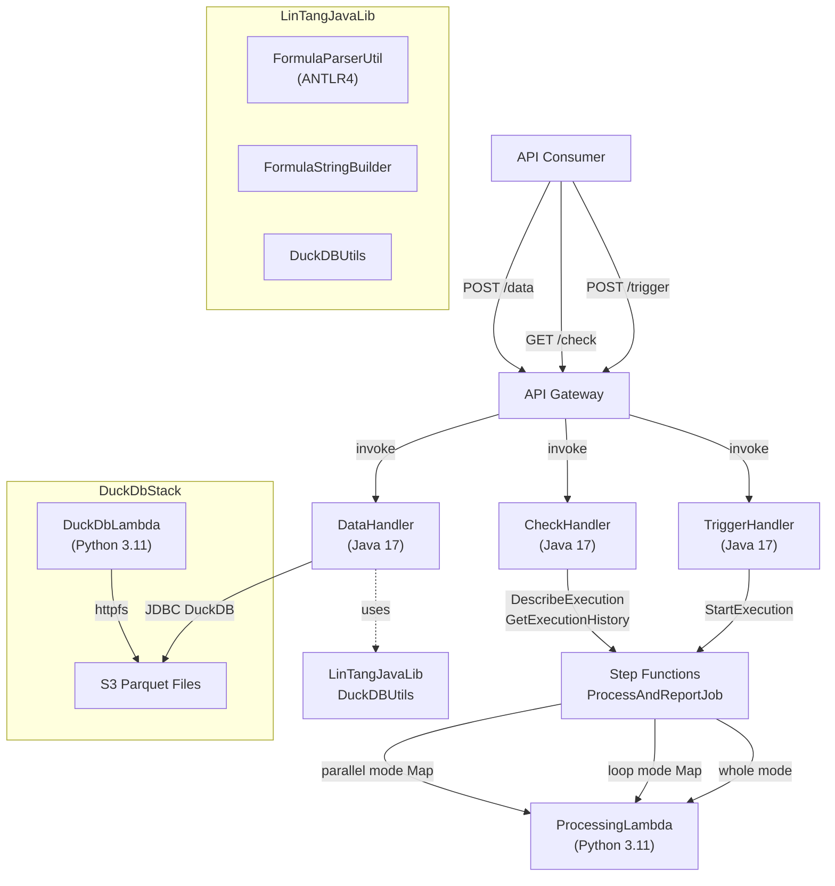
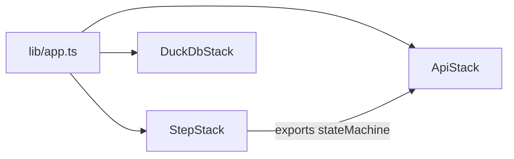
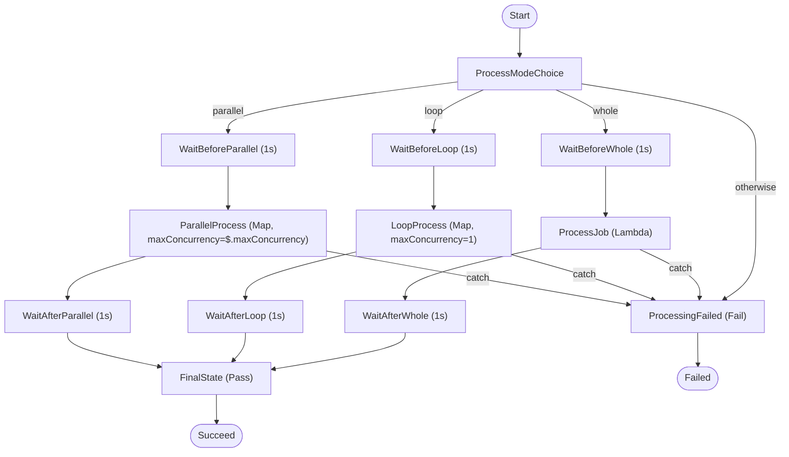

# Design Document

## Overview

The Step Functions Serverless Workflow is a complete AWS serverless application that orchestrates item processing through AWS Step Functions. The system exposes three REST endpoints via API Gateway: `POST /trigger` to start a state machine execution, `GET /check` to poll execution status, and `POST /data` to run ad-hoc SQL queries over S3 Parquet files. Processing is delegated to a Python Lambda that supports three concurrency modes (whole, loop, parallel). A shared Java library (LinTangJavaLib) provides an ANTLR4-based formula parser and DuckDB query utilities. A standalone DuckDB Lambda stack enables direct Parquet querying from Python.

The application is deployed via three CDK TypeScript stacks: `StepStack` (state machine + processing lambda), `ApiStack` (API Gateway + Java lambdas), and `DuckDbStack` (standalone DuckDB lambda).

---

## Architecture



### CDK Stack Dependency



`ApiStack` depends on `StepStack` via the exported `stateMachine` reference. `DuckDbStack` is independent.

---

## Components and Interfaces

### TriggerHandler (Java 17)

Implements `RequestHandler<APIGatewayProxyRequestEvent, APIGatewayProxyResponseEvent>`.

**Input validation:**
- Body must be present and non-empty
- `processType` must be one of `parallel`, `loop`, `whole` (case-insensitive; normalised to lowercase)
- Either `items` (non-empty array of non-empty strings) or `item` (single non-empty string) must be provided
- `maxConcurrency` defaults to `items.length` if not provided

**State machine input payload:**
```json
{
  "processType": "parallel|loop|whole",
  "items": ["item1", "item2"],
  "maxConcurrency": 2
}
```

**Success response (HTTP 200):**
```json
{ "message": "State Machine execution started successfully", "executionId": "<uuid>" }
```

**Error responses:** HTTP 400 for validation failures, HTTP 500 for missing ARN or SFN errors.

**CORS:** `Access-Control-Allow-Origin: *` on all responses.

---

### CheckHandler (Java 17)

Implements `RequestHandler<APIGatewayProxyRequestEvent, APIGatewayProxyResponseEvent>`.

**Input:** `executionId` query parameter (required).

**ARN construction:**
```
arn:aws:states:{AWS_REGION}:{AWS_ACCOUNT_ID}:execution:ProcessAndReportJob:{executionId}
```

**Success response (HTTP 200):**
```json
{
  "executionId": "...",
  "status": "SUCCEEDED|RUNNING|FAILED",
  "output": { ... } | null,
  "startDate": "...",
  "stopDate": "..." | null,
  "cause": null | "...",
  "error": null | "...",
  "events": [...]
}
```

**Error responses:** HTTP 400 for missing executionId, HTTP 404 for non-existent execution, HTTP 500 for SFN errors.

**CORS:** `Access-Control-Allow-Origin: *` on all responses.

---

### DataHandler (Java 17)

Implements `RequestHandler<APIGatewayProxyRequestEvent, APIGatewayProxyResponseEvent>`.

**Input:**
```json
{ "s3_path": "s3://bucket/path/file.parquet", "query": "SELECT * FROM parquet_data LIMIT 10" }
```

Uses `DuckDBUtils.executeQuery()` from LinTangJavaLib. Sets DuckDB home to `/tmp`, installs and loads `httpfs`, optionally creates a `parquet_data` view if the query references it.

**Success response (HTTP 200):**
```json
{ "message": "Query executed successfully", "s3_path": "...", "row_count": 5, "columns": [...], "data": [...] }
```

---

### ProcessingLambda (Python 3.11)

Handler: `index.handler`

**Input variants:**
- `{ "items": ["a", "b"] }` → returns list of result objects
- `{ "item": "a" }` → returns single result object
- Bare string → returns single result object

**Result object shape:**
```json
{
  "item": "original",
  "processedItem": "ORIGINAL",
  "customData": { ... },
  "processedAt": "2025-01-01T00:00:00.000000+00:00Z",
  "status": "processed",
  "message": "Processed item: original at ..."
}
```

Raises `ValueError` for item value `"FAIL!"`. Sleeps 10 seconds per item to simulate work.

---

### DuckDbLambda (Python 3.11)

Handler: `index.handler` in `DuckDbLambda/`

Same `s3_path` + `query` interface as DataHandler. Uses native Python `duckdb` client with the public prebuilt layer (`arn:aws:lambda:us-west-2:911510765542:layer:duckdb-python311-x86_64:12`). Reads `AWS_REGION` from environment for S3 region configuration.

---

### State Machine: ProcessAndReportJob

Three processing chains, all converging to `FinalState → Succeed`:



**FinalState** assembles: `originalInput`, `results`, `count`, `processedAt`, `status`.

**Timeout:** 30 minutes (`MaxDurationSeconds: 1800`).

---

### LinTangJavaLib: Formula Parser

ANTLR4 grammar (`Formula.g4`) defines:
- Arithmetic: `+`, `-`, `*`, `/`, `^` with standard precedence (power > unary > multiplicative > additive)
- Literals: `NUMBER` (integer/float), `STRING` (double-quoted), `BOOLEAN` (`TRUE`/`FALSE`)
- Cell references: `CELL_REF` (`[A-Z]+[0-9]+`), `CELL_RANGE` (`CELL_REF:CELL_REF`)
- Function calls: `IDENTIFIER(argList?)`
- Parenthesised sub-expressions

**Parse pipeline:**
```
formula string → FormulaLexer → CommonTokenStream → FormulaParser → ParseTree → FormulaASTBuilder → ASTNode
```

**Visitor implementations:**
- `FormulaASTBuilder` — builds typed AST from parse tree
- `FormulaStringBuilder` — serialises AST back to formula string
- `CellReferenceExtractor` — collects all cell references from an AST
- `EvaluationVisitor` — evaluates numeric expressions

---

### LinTangJavaLib: DuckDBUtils

`DuckDBUtils.executeQuery(s3Path, query, logger)` — creates an in-memory DuckDB JDBC connection, sets home to `/tmp`, installs/loads `httpfs`, optionally creates a `parquet_data` view, executes the query, and returns `{ row_count, columns, data }`.

---

## Data Models

### TriggerRequest (parsed from POST /trigger body)

| Field | Type | Required | Description |
|---|---|---|---|
| `processType` | string | yes | `parallel`, `loop`, or `whole` (case-insensitive) |
| `items` | string[] | no* | Non-empty array of non-empty strings |
| `item` | string | no* | Single item (alternative to `items`) |
| `maxConcurrency` | integer | no | Defaults to `items.length` |
| `customData` | object | no | Passed through to ProcessingLambda |

*Either `items` or `item` must be provided.

### StateMachineInput

| Field | Type | Description |
|---|---|---|
| `processType` | string | Normalised lowercase mode |
| `items` | string[] | Items to process |
| `maxConcurrency` | integer | Concurrency limit for parallel mode |

### TriggerResponse (HTTP 200)

| Field | Type | Description |
|---|---|---|
| `message` | string | Human-readable success message |
| `executionId` | string | UUID portion of the execution name |

### CheckResponse (HTTP 200)

| Field | Type | Description |
|---|---|---|
| `executionId` | string | The queried execution ID |
| `status` | string | `RUNNING`, `SUCCEEDED`, `FAILED`, etc. |
| `output` | object\|null | Parsed JSON output (null if not complete) |
| `startDate` | string | ISO 8601 start timestamp |
| `stopDate` | string\|null | ISO 8601 stop timestamp (null if running) |
| `cause` | string\|null | Failure cause (null if not failed) |
| `error` | string\|null | Error code (null if not failed) |
| `events` | array | Full execution history events |

### ProcessingResult (per item)

| Field | Type | Description |
|---|---|---|
| `item` | string | Original item value |
| `processedItem` | string | Uppercased item value |
| `customData` | object | Passed-through custom data |
| `processedAt` | string | ISO 8601 UTC timestamp |
| `status` | string | Always `"processed"` |
| `message` | string | Human-readable processing message |

### DataRequest (POST /data body)

| Field | Type | Required | Description |
|---|---|---|---|
| `s3_path` | string | yes | S3 URI to Parquet file |
| `query` | string | yes | SQL query to execute |

### DataResponse (HTTP 200)

| Field | Type | Description |
|---|---|---|
| `message` | string | `"Query executed successfully"` |
| `s3_path` | string | Echo of input s3_path |
| `row_count` | integer | Number of rows returned |
| `columns` | string[] | Column names |
| `data` | object[] | Array of row objects |

### FormulaAST Node Types

| Node Type | Fields | Description |
|---|---|---|
| `NumberNode` | `value: double` | Numeric literal |
| `StringNode` | `value: String` | String literal (without quotes) |
| `BooleanNode` | `value: boolean` | Boolean literal |
| `CellRefNode` | `ref: String` | Cell reference (e.g., `A1`) |
| `CellRangeNode` | `range: String` | Cell range (e.g., `A1:B10`) |
| `BinaryOpNode` | `op: String, left: ASTNode, right: ASTNode` | Binary operation |
| `UnaryOpNode` | `op: String, operand: ASTNode` | Unary operation |
| `FunctionCallNode` | `name: String, args: List<ASTNode>` | Function call |

---

## Correctness Properties

*A property is a characteristic or behavior that should hold true across all valid executions of a system — essentially, a formal statement about what the system should do. Properties serve as the bridge between human-readable specifications and machine-verifiable correctness guarantees.*

### Property 1: Valid trigger requests always return executionId and message

*For any* valid POST /trigger request body (with a valid `processType`, non-empty `items` array of non-empty strings), the TriggerHandler response SHALL have HTTP status 200 and the response body SHALL contain both a `message` field and an `executionId` field.

**Validates: Requirements 1.1**

---

### Property 2: processType is always normalised to lowercase

*For any* `processType` value that is a case-variant of `parallel`, `loop`, or `whole` (e.g., `PARALLEL`, `Loop`, `WHOLE`), the state machine input payload constructed by TriggerHandler SHALL contain the lowercase version of that value.

**Validates: Requirements 1.2**

---

### Property 3: All items are forwarded to the state machine

*For any* non-empty array of non-empty strings provided as `items`, the state machine input payload SHALL contain exactly those items in the same order.

**Validates: Requirements 1.3**

---

### Property 4: Single item is treated as a one-element array

*For any* non-empty string provided as `item` (with no `items` field), the state machine input payload SHALL contain an `items` array of length 1 containing that string.

**Validates: Requirements 1.4**

---

### Property 5: maxConcurrency defaults to items length

*For any* valid trigger request without a `maxConcurrency` field, the state machine input payload SHALL contain `maxConcurrency` equal to the length of the `items` array. *For any* valid trigger request with a positive integer `maxConcurrency`, that exact value SHALL be forwarded.

**Validates: Requirements 1.5**

---

### Property 6: Execution names are unique and correctly formatted

*For any* two independently generated execution names, they SHALL both match the pattern `execution-{UUID}` (where UUID is a standard UUID v4 format) and SHALL be distinct from each other.

**Validates: Requirements 1.6**

---

### Property 7: Invalid processType values always return HTTP 400

*For any* string that is not a case-insensitive match for `parallel`, `loop`, or `whole`, submitting it as `processType` SHALL result in HTTP 400 with the message `"processType must be one of: parallel, loop, whole"`.

**Validates: Requirements 1.9**

---

### Property 8: Items arrays with blank strings are rejected

*For any* `items` array containing at least one empty or whitespace-only string, the TriggerHandler SHALL return HTTP 400 with the message `"items must contain non-empty strings"`.

**Validates: Requirements 1.11**

---

### Property 9: CORS headers are present on all TriggerHandler responses

*For any* request to TriggerHandler (valid, invalid, or error-producing), the response SHALL include the header `Access-Control-Allow-Origin: *`.

**Validates: Requirements 1.15**

---

### Property 10: Valid check requests return all required response fields

*For any* valid `executionId` that corresponds to an existing execution, the CheckHandler response SHALL have HTTP status 200 and the body SHALL contain `executionId`, `status`, `output`, `startDate`, `stopDate`, `cause`, `error`, and `events` fields.

**Validates: Requirements 2.1**

---

### Property 11: Execution ARN is correctly constructed

*For any* combination of `AWS_REGION`, `AWS_ACCOUNT_ID`, and `executionId` values, the ARN constructed by CheckHandler SHALL match the pattern `arn:aws:states:{region}:{accountId}:execution:ProcessAndReportJob:{executionId}`.

**Validates: Requirements 2.8**

---

### Property 12: CORS headers are present on all CheckHandler responses

*For any* request to CheckHandler (valid, invalid, or error-producing), the response SHALL include the header `Access-Control-Allow-Origin: *`.

**Validates: Requirements 2.9**

---

### Property 13: ProcessingLambda output length matches input items length

*For any* non-empty list of items provided in the `items` field, the ProcessingLambda SHALL return a list of result objects whose length equals the length of the input `items` array.

**Validates: Requirements 4.1**

---

### Property 14: ProcessingLambda result objects have the correct shape and values

*For any* non-empty, non-`"FAIL!"` item string, the result object returned by ProcessingLambda SHALL contain `item` (equal to the input), `processedItem` (equal to the uppercased input), `customData` (equal to the input `customData`), `processedAt` (a valid ISO 8601 UTC timestamp), `status` equal to `"processed"`, and a non-empty `message` field.

**Validates: Requirements 4.3, 4.6**

---

### Property 15: DataHandler response contains all required fields

*For any* valid `s3_path` and `query` pair that executes successfully, the DataHandler response SHALL have HTTP status 200 and the body SHALL contain `message`, `s3_path`, `row_count`, `columns`, and `data` fields.

**Validates: Requirements 5.1**

---

### Property 16: parquet_data view is created when query references it

*For any* query string containing the substring `parquet_data`, the DataHandler (and DuckDbLambda) SHALL execute a `CREATE VIEW parquet_data AS SELECT * FROM read_parquet(...)` statement before running the query.

**Validates: Requirements 5.2**

---

### Property 17: Formula parser round-trip

*For any* valid formula string `f`, parsing `f` with `FormulaParserUtil.parse()`, then serialising the resulting AST with `FormulaStringBuilder`, then parsing the serialised string again SHALL produce a `FormulaAST` that is structurally equivalent to the one produced by the first parse.

**Validates: Requirements 6.1, 6.12, 6.13**

---

### Property 18: Invalid formula strings always throw exceptions

*For any* string that does not conform to the Formula grammar (e.g., unmatched parentheses, invalid tokens, empty string), calling `FormulaParserUtil.parse()` SHALL throw an exception.

**Validates: Requirements 6.2**

---

### Property 19: Formula parser handles all supported literal and reference types

*For any* formula composed of numeric literals, string literals, boolean literals, cell references, cell ranges, and function calls (individually or in combination), `FormulaParserUtil.parse()` SHALL succeed and the round-trip property (Property 17) SHALL hold.

**Validates: Requirements 6.6, 6.7, 6.8, 6.9, 6.10, 6.11**

---

## Error Handling

### TriggerHandler

| Condition | HTTP Status | Response Body |
|---|---|---|
| Missing/empty body | 400 | `{"message": "Request body is required"}` |
| Missing `processType` | 400 | `{"message": "processType is required (parallel|loop|whole)"}` |
| Invalid `processType` | 400 | `{"message": "processType must be one of: parallel, loop, whole"}` |
| Empty `items` array | 400 | `{"message": "items must be a non-empty array of strings"}` |
| Blank string in `items` | 400 | `{"message": "items must contain non-empty strings"}` |
| Neither `items` nor `item` | 400 | `{"message": "Provide either 'items' (array of strings) or 'item' (single string)"}` |
| Missing `STATE_MACHINE_ARN` env var | 500 | `{"message": "STATE_MACHINE_ARN not configured"}` |
| SFN `StartExecution` failure | 500 | `{"message": "Failed to start state machine execution", "error": "..."}` |

### CheckHandler

| Condition | HTTP Status | Response Body |
|---|---|---|
| Missing/empty `executionId` | 400 | `{"message": "Execution ID is required", "error": "Missing executionId parameter"}` |
| `ExecutionDoesNotExist` from SFN | 404 | `{"message": "Execution not found", "error": "..."}` |
| Other SFN service error | 500 | `{"message": "Failed to check execution status", "error": "..."}` |

### DataHandler / DuckDbLambda

| Condition | HTTP Status | Response Body |
|---|---|---|
| Missing `s3_path` or `query` | 400 | `{"message": "Missing s3_path or query in request"}` |
| DuckDB query failure | 500 | `{"message": "Error executing query: ..."}` |

### ProcessingLambda

| Condition | Behaviour |
|---|---|
| Item value is `"FAIL!"` | Raises `ValueError` — Lambda exits with error, Step Functions catches and routes to `ProcessingFailed` |

### State Machine

| Condition | Behaviour |
|---|---|
| Unrecognised `processType` | `ProcessModeChoice` routes to `ProcessingFailed` Fail state |
| Any Lambda/Map error | `addCatch(failureState)` routes to `ProcessingFailed` Fail state |
| Execution exceeds 30 minutes | State machine times out and transitions to `TIMED_OUT` status |

### Formula Parser

| Condition | Behaviour |
|---|---|
| Invalid formula syntax | ANTLR4 parser error → `FormulaParserUtil.parse()` throws `Exception` |
| Unknown AST node type | `FormulaASTBuilder.visitAtom()` throws `RuntimeException("Unknown atom type")` |

---

## Testing Strategy

### Dual Testing Approach

Both unit tests and property-based tests are required. Unit tests verify specific examples, edge cases, and integration points. Property-based tests verify universal properties across many generated inputs.

### Unit Tests

**Java (JUnit 5 + Mockito):**

- `TriggerHandlerTest` — test each validation error path (missing body, invalid processType, empty items, blank items, missing item/items, missing ARN), mock SFN client for success and failure paths
- `CheckHandlerTest` — test missing executionId, mock SFN for SUCCEEDED/RUNNING/FAILED/ExecutionDoesNotExist/generic error
- `DataHandlerTest` — test missing s3_path/query, mock DuckDB connection for success and failure
- `FormulaParserBasicTest` — test specific operator precedence examples (e.g., `2+3*4`, `(2+3)*4`), unary operators, parentheses, boolean literals
- `FormulaIntegrationTest` — test full parse-evaluate-print pipeline with known inputs
- `EvaluationVisitorTest` — test arithmetic evaluation with specific numeric examples
- `CellReferenceExtractorTest` — test extraction from known formulas

**Python (pytest):**

- `test_processing_lambda.py` — test items array processing, single item processing, FAIL! error, customData passthrough
- `test_duckdb_lambda.py` — test missing fields, mock duckdb for success and failure

**CDK (Jest + aws-cdk-lib/assertions):**

- `step.test.ts` — assert StepStack has StateMachine with correct name, timeout, and ProcessingLambda; assert ApiStack has API Gateway with CORS, TriggerHandler/CheckHandler/DataHandler with correct IAM policies; assert DuckDbStack has DuckDbLambda with correct layer and S3 permissions

### Property-Based Tests

**Java — use [jqwik](https://jqwik.net/) (property-based testing for JUnit 5):**

Configure each test with `@Property(tries = 100)`.

Tag format in comments: `// Feature: step-functions-serverless-workflow, Property {N}: {property_text}`

| Property | Test Class | Generator Strategy |
|---|---|---|
| P1: Valid trigger returns 200 + fields | `TriggerHandlerPropertyTest` | Generate valid processType variants, random non-empty string arrays |
| P2: processType normalised to lowercase | `TriggerHandlerPropertyTest` | Generate random casing of `parallel`/`loop`/`whole` |
| P3: All items forwarded | `TriggerHandlerPropertyTest` | Generate random non-empty string arrays |
| P4: Single item as one-element array | `TriggerHandlerPropertyTest` | Generate random non-empty strings |
| P5: maxConcurrency default/forwarding | `TriggerHandlerPropertyTest` | Generate with/without maxConcurrency |
| P6: Execution names unique and formatted | `TriggerHandlerPropertyTest` | Generate multiple execution names, check format + uniqueness |
| P7: Invalid processType → 400 | `TriggerHandlerPropertyTest` | Generate arbitrary strings excluding valid values |
| P8: Blank items → 400 | `TriggerHandlerPropertyTest` | Generate arrays with at least one blank string |
| P9: CORS on all TriggerHandler responses | `TriggerHandlerPropertyTest` | Generate valid and invalid requests |
| P10: Valid check returns all fields | `CheckHandlerPropertyTest` | Mock SFN, generate random executionId strings |
| P11: ARN construction | `CheckHandlerPropertyTest` | Generate random region/account/executionId |
| P12: CORS on all CheckHandler responses | `CheckHandlerPropertyTest` | Generate valid and invalid requests |
| P13: Output length matches input | `ProcessingLambdaPropertyTest` (Python/Hypothesis) | Generate random non-empty string lists |
| P14: Result object shape and values | `ProcessingLambdaPropertyTest` (Python/Hypothesis) | Generate random non-FAIL! strings |
| P15: DataHandler response fields | `DataHandlerPropertyTest` | Mock DuckDB, generate random s3_path/query pairs |
| P16: parquet_data view creation | `DataHandlerPropertyTest` | Generate queries with/without parquet_data substring |
| P17: Formula round-trip | `FormulaRoundTripPropertyTest` | Generate random valid formula strings using grammar-aware generator |
| P18: Invalid formulas throw | `FormulaParserPropertyTest` | Generate syntactically invalid strings |
| P19: All literal/reference types | `FormulaParserPropertyTest` | Generate formulas with each supported literal/reference type |

**Python — use [Hypothesis](https://hypothesis.readthedocs.io/):**

Configure with `@settings(max_examples=100)`.

- `test_processing_lambda_properties.py` — Properties P13, P14
- `test_duckdb_lambda_properties.py` — Property P16 (Python DuckDbLambda variant)

**Property Test Configuration:**
- Minimum 100 iterations per property test
- Each test tagged with: `// Feature: step-functions-serverless-workflow, Property {N}: {property_text}`
- Each correctness property is implemented by exactly one property-based test
