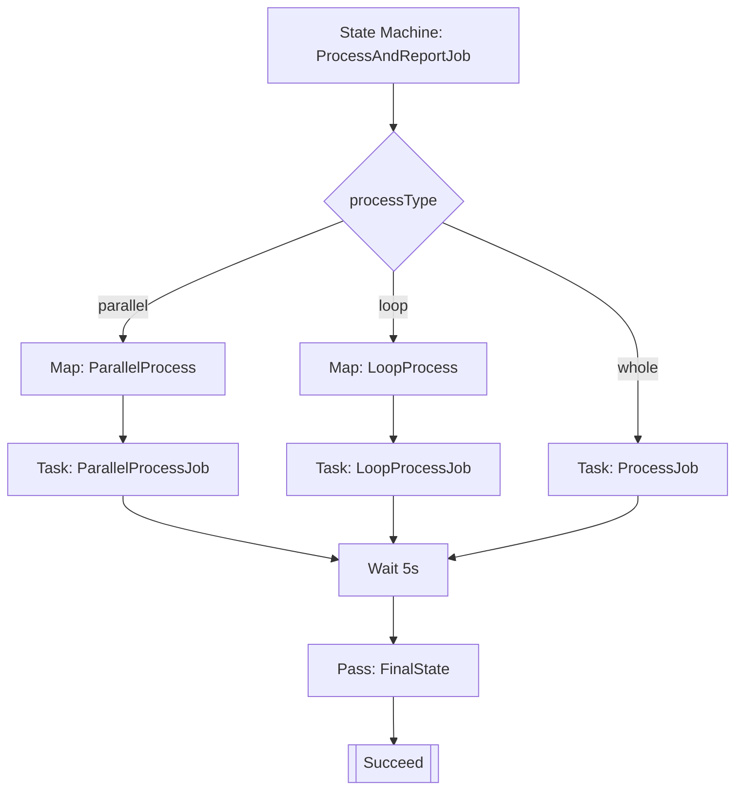

# Step Functions Serverless Workflow

A complete serverless application using AWS Step Functions, API Gateway, and Lambda functions (Python, Java, Node.js).

## Architecture

- **API Gateway**: REST endpoints for triggering and checking execution status
- **Trigger Lambda**: Java 17 — accepts JSON requests and starts Step Functions executions
- **Check Lambda**: Java 17 — retrieves execution status and output
- **Processing Lambda**: Python 3.11 — processes state machine input and returns results
- **Step Functions**: Orchestrates Lambda execution with wait and completion tasks

### State Machine Dependencies



This diagram shows the Step Functions state machine flow: it branches on `processType`, runs the relevant map/task state, then converges through a wait and final pass state to `Succeed`.

## Project Structure

```
.
├── lib/                          # CDK TypeScript definitions
│   └── step-stack.ts            # Main CDK stack
├── test/                         # Jest unit tests
│   └── step.test.ts             # CDK stack tests
├── LinTangJavaLambda/           # Java Lambda project
│   ├── pom.xml                  # Maven configuration
│   └── src/main/java/.../       # TriggerHandler, CheckHandler
├── LinTangPythonLambda/         # Python Lambda project
│   ├── index.py                 # Processing Lambda handler
│   └── requirements.txt          # Python dependencies
├── API_SAMPLE_REQUESTS.md       # API endpoint examples
└── cdk.json                     # CDK configuration
```

## Prerequisites

- **Node.js** 16+ (for CDK)
- **Java** 17+ (for Maven builds)
- **Python** 3.11+ (optional, for local testing)
- **Maven** 3.6+ (for Java Lambda builds)
- **AWS CLI** configured with credentials
- **AWS CDK** CLI: `npm install -g aws-cdk`

## Build Instructions

### 1. Build Java Lambdas

Build the Maven project to create the shaded jar with both Java handlers:

```bash
cd LinTangJavaLambda
mvn clean package -DskipTests
cd ..
```

This generates `LinTangJavaLambda/target/function.jar` containing:
- `com.lintang.lambda.TriggerHandler` — handles `/trigger` POST requests
- `com.lintang.lambda.CheckHandler` — handles `/check` GET requests

### 2. Build TypeScript and Run Tests

Compile the CDK stack and run all tests:

```bash
npm install
npm run build
npm test
```

Expected output: **All tests pass** (33 tests).

### 3. Deploy to AWS

Synthesize and deploy the CDK stack:

```bash
cdk synth
cdk deploy --require-approval never
```

After deployment, the stack outputs will show:
- **ApiEndpoint**: The base API Gateway URL
- **StateMachineArn**: The Step Functions state machine ARN

## Usage

### Trigger State Machine Execution

Use `processType` to control execution mode and send either `items` (array) or a single `item`.

```bash
API_URL="https://xxxxxxx.execute-api.us-west-2.amazonaws.com/prod"

# Whole mode: Lambda processes items sequentially inside handler
curl -X POST "$API_URL/trigger" \
  -H "Content-Type: application/json" \
  -d '{
    "processType": "whole",
    "items": ["item-1", "item-2", "item-3"],
    "customData": {"source": "docs"}
  }'

# Loop mode: Step Functions iterates sequentially (Map with maxConcurrency=1)
curl -X POST "$API_URL/trigger" \
  -H "Content-Type: application/json" \
  -d '{
    "processType": "loop",
    "items": ["task-1", "task-2", "task-3"]
  }'

# Parallel mode: Step Functions iterates concurrently (maxConcurrency = items.length)
curl -X POST "$API_URL/trigger" \
  -H "Content-Type: application/json" \
  -d '{
    "processType": "parallel",
    "items": ["a", "b", "c", "d"]
  }'

# Single-item convenience: send 'item' instead of 'items'
curl -X POST "$API_URL/trigger" \
  -H "Content-Type: application/json" \
  -d '{
    "processType": "whole",
    "item": "single-item"
  }'
```

Response:
```json
{
  "message": "State Machine execution started successfully",
  "executionId": "a1b2c3d4-e5f6-7890-abcd-ef1234567890"
}
```

### Check Execution Status

```bash
EXECUTION_ID="a1b2c3d4-e5f6-7890-abcd-ef1234567890"

curl -X GET "$API_URL/check?executionId=$EXECUTION_ID" \
  -H "Content-Type: application/json"
```

Response:
```json
{
  "executionId": "a1b2c3d4-e5f6-7890-abcd-ef1234567890",
  "status": "SUCCEEDED",
  "output": {...},
  "startDate": "2025-12-14T...",
  "stopDate": "2025-12-14T...",
  "cause": null,
  "error": null
}
```

See `API_SAMPLE_REQUESTS.md` for more examples.

## Useful Commands

### Development

- `npm run build` — Compile TypeScript to JavaScript
- `npm run watch` — Watch and auto-compile on changes
- `npm test` — Run Jest unit tests
- `npm test -- --coverage` — Generate coverage report

### CDK Operations

- `cdk synth` — Emit synthesized CloudFormation template
- `cdk diff` — Compare deployed stack with current state
- `cdk destroy` — Tear down the deployed stack

### AWS CLI

- `aws sso login --profile <your-profile-name>` — Authenticate with AWS
- `aws stepfunctions list-executions --state-machine-arn <arn>` — List executions
- `aws stepfunctions describe-execution --execution-arn <arn>` — Get execution details
- `aws lambda logs /aws/lambda/<function-name>` — View Lambda logs (CloudWatch)

## Lambda Runtimes and Languages

- **TriggerHandler** (Java 17): Parses requests, generates UUIDs, calls `startExecution`
- **CheckHandler** (Java 17): Calls `describeExecution` and `getExecutionHistory`
- **Processing Lambda** (Python 3.11): Extracts fields, transforms input, returns structured output

## Environment Variables

### TriggerHandler
- `STATE_MACHINE_ARN` — Set by CDK; the Step Functions state machine ARN

### CheckHandler
- `AWS_ACCOUNT_ID` — Set by CDK; used to construct execution ARNs
- `AWS_REGION` — Automatically provided by Lambda runtime

## IAM Permissions

The CDK stack grants:
- **TriggerHandler**: `states:StartExecution` on the state machine
- **CheckHandler**: `states:DescribeExecution`, `states:GetExecutionHistory` on executions
- **ProcessingLambda**: Implicit permissions to execute within the state machine

## Cleanup

To remove all AWS resources:

```bash
cdk destroy
```

## Support

For more details on API endpoints and sample requests, see `API_SAMPLE_REQUESTS.md`.
